<div align="center">

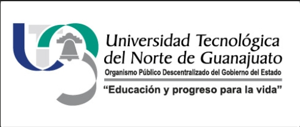

# Universidad Tecnológica del Norte de Guanajuato

## Ingeniería en Redes Inteligentes y Ciberseguridad

---

**Materia:** Automatización de Infraestructura Digital

**Unidad I:** Entornos de desarrollo en la automatización de redes

**Grupo:** GIRI6091

**Nombre:** Martha Yvette Rincon Torres

**Número de Control:** 1223100744

**Fecha:** Lunes 01 de junio del 2026

</div>

---

## Índice

1. [Introducción](#introducción)
2. [Desarrollo](#desarrollo)
   - 2.1 [Descripción de herramientas](#descripción-de-herramientas)
     - [Docker Engine](#docker-engine)
     - [Docker Compose](#docker-compose)
     - [Visual Studio Code](#visual-studio-code)
     - [Git y GitHub](#git-y-github)
   - 2.2 [Procedimiento de instalación](#procedimiento-de-instalación)
     - [Visual Studio Code](#visual-studio-code-1)
     - [Docker Engine](#docker-engine-1)
     - [Docker Compose](#docker-compose-1)
     - [Git](#git)
   - 2.3 [Evidencias de funcionamiento](#evidencias-de-funcionamiento)
     - [hello-world](#ejecución-de-hello-world)
     - [Contenedores activos](#contenedores-activos-docker-ps)
     - [Dockerfile Backend](#dockerfile-del-backend)
     - [Dockerfile Frontend](#dockerfile-del-frontend)
     - [Archivo stack-myrt.yml](#archivo-stackyml)
     - [Frontend](#frontend-funcionando)
     - [Backend](#backend-funcionando)
     - [PhpMyAdmin](#phpmyadmin-funcionando)
3. [Lista de verificación](#lista-de-verificación)
4. [Conclusión](#conclusión)
5. [Anexo de recursos](#anexo-de-recursos)
6. [Bibliografía](#bibliografía)

---

## Introducción

En el contexto actual del desarrollo tecnológico, la automatización de infraestructura digital se ha convertido en una disciplina fundamental para los ingenieros en redes y ciberseguridad. La capacidad de desplegar, gestionar y escalar servicios de forma automatizada representa una ventaja competitiva esencial en entornos empresariales modernos. En esta primera unidad de la materia Automatización de Infraestructura Digital, se aborda la configuración de un entorno de desarrollo orientado a la automatización de redes mediante el uso de herramientas ampliamente adoptadas en la industria.

Para llevar a cabo este proyecto, se utilizó una máquina virtual con sistema operativo Debian, sobre la cual se instalaron y configuraron Docker Engine y Git como herramientas principales. Docker Engine permite la creación y ejecución de contenedores, lo que facilita el despliegue de aplicaciones de forma aislada, reproducible y eficiente. Docker Compose complementa esta funcionalidad al permitir la definición y orquestación de múltiples contenedores mediante un archivo YAML, simplificando la gestión de aplicaciones con varios servicios interdependientes. Por su parte, Git proporciona el control de versiones necesario para mantener un historial del código y colaborar de manera ordenada en el desarrollo del proyecto.

Como editor de código se utilizó Visual Studio Code en Windows, una herramienta ligera y extensible que ofrece soporte para múltiples lenguajes, integración con Git y una amplia biblioteca de extensiones que optimizan el flujo de trabajo del desarrollador. El resultado final de esta unidad es el despliegue de una aplicación compuesta por un frontend en Nginx, un backend en Node.js y una base de datos MySQL, accesible también mediante PhpMyAdmin, todo orquestado con Docker Compose y documentado en este reporte.

---

## Desarrollo

### Descripción de herramientas

#### Docker Engine

Docker Engine es el motor de contenedorización de código abierto que permite construir, ejecutar y gestionar contenedores en un sistema operativo Linux. Un contenedor es una unidad de software que empaqueta el código de una aplicación junto con todas sus dependencias, garantizando que se ejecute de manera consistente en cualquier entorno. En este proyecto, Docker Engine fue instalado sobre una máquina virtual con Debian y es la base sobre la que operan todos los servicios desplegados.

#### Docker Compose

Docker Compose es una herramienta que permite definir y ejecutar aplicaciones multi-contenedor mediante un archivo de configuración en formato YAML. Con un solo comando (`docker compose up`) es posible levantar todos los servicios definidos en el archivo, incluyendo sus redes, volúmenes y dependencias. En este proyecto se utilizó para orquestar los servicios de MySQL, PhpMyAdmin, backend y frontend de forma coordinada.


#### Visual Studio Code

Visual Studio Code es un editor de código fuente desarrollado por Microsoft, disponible para Windows, macOS y Linux. Es ligero, altamente extensible y cuenta con soporte nativo para Git, depuración, resaltado de sintaxis y autocompletado. En este proyecto fue utilizado en Windows como entorno principal de edición de los archivos `Dockerfile`, `docker-compose.yml` y el código fuente del proyecto.

#### Git y GitHub

Git es un sistema de control de versiones distribuido que permite registrar el historial de cambios de un proyecto, trabajar en ramas independientes y colaborar con otros desarrolladores. GitHub es la plataforma en la nube que aloja repositorios Git, facilitando el trabajo colaborativo y la publicación de proyectos. En este proyecto, Git fue instalado en Debian y GitHub se utilizó como repositorio remoto para subir el código y este reporte.

---

### Procedimiento de instalación

#### Visual Studio Code

Visual Studio Code fue descargado desde el sitio oficial [https://code.visualstudio.com](https://code.visualstudio.com) e instalado en Windows. Una vez instalado, se agregaron las siguientes extensiones útiles para el proyecto:

- **Docker** : permite gestionar contenedores e imágenes desde VS Code.
- **Remote - SSH**: permite conectarse a la máquina virtual Debian desde VS Code.
- **GitLens**: mejora la integración con Git.

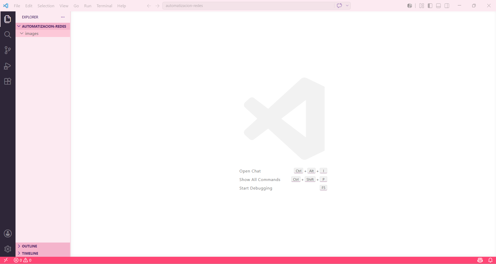

#### Docker Engine

Docker Engine fue instalado en la máquina virtual con Debian siguiendo los pasos oficiales de la documentación de Docker. Los comandos utilizados fueron los siguientes:

```bash
# Actualizar el sistema
sudo apt-get update

# Instalar dependencias
sudo apt-get install ca-certificates curl gnupg

# Agregar la clave GPG oficial de Docker
sudo install -m 0755 -d /etc/apt/keyrings
curl -fsSL https://download.docker.com/linux/debian/gpg | sudo gpg --dearmor -o /etc/apt/keyrings/docker.gpg
sudo chmod a+r /etc/apt/keyrings/docker.gpg

# Agregar el repositorio de Docker
echo \
  "deb [arch=$(dpkg --print-architecture) signed-by=/etc/apt/keyrings/docker.gpg] \
  https://download.docker.com/linux/debian \
  $(. /etc/os-release && echo "$VERSION_CODENAME") stable" | \
  sudo tee /etc/apt/sources.list.d/docker.list > /dev/null

# Instalar Docker Engine
sudo apt-get update
sudo apt-get install docker-ce docker-ce-cli containerd.io docker-buildx-plugin docker-compose-plugin
```

Verificación de la instalación:

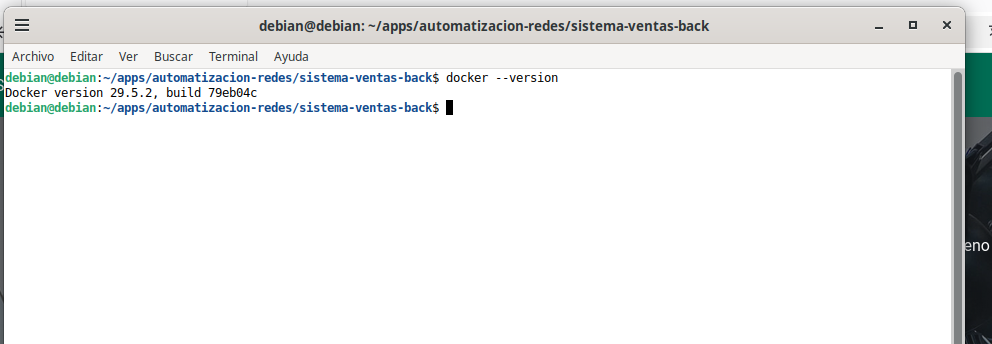

#### Docker Compose

Docker Compose fue instalado como parte del paquete de Docker Engine mediante el plugin docker-compose-plugin. Esta herramienta permite definir y administrar aplicaciones compuestas por múltiples contenedores utilizando archivos YAML. La verificación se realizó con el siguiente comando:

```bash
docker compose version
```

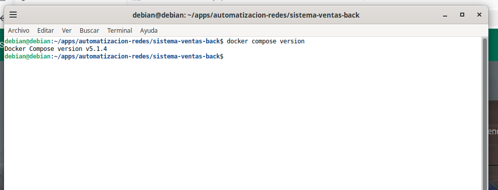

#### Git

Git fue instalado en Debian con el siguiente comando:

```bash
sudo apt-get install git
```

Verificación de la instalación:

```bash
git --version
```

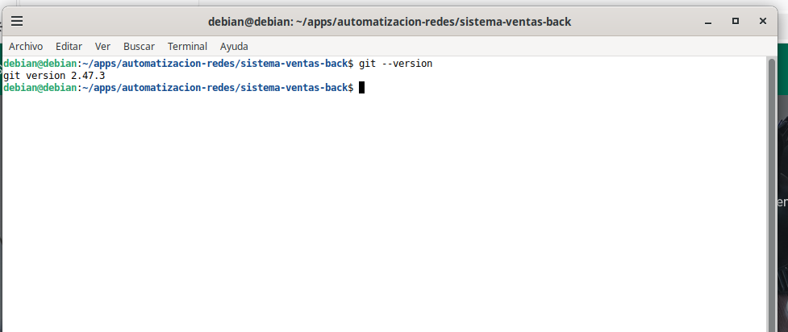

---

### Evidencias de funcionamiento

#### Ejecución de hello-world

Para verificar el correcto funcionamiento de Docker Engine se ejecutó la imagen oficial `hello-world`:

```bash
docker run hello-world
```

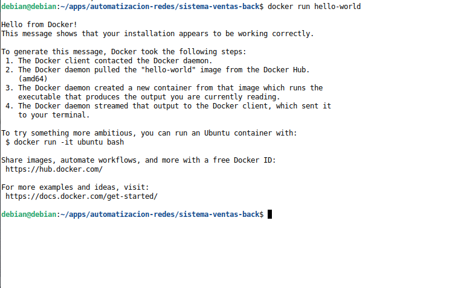

#### Contenedores activos (docker ps)

Se verificó que los contenedores del proyecto estuvieran en ejecución:

```bash
docker ps
```

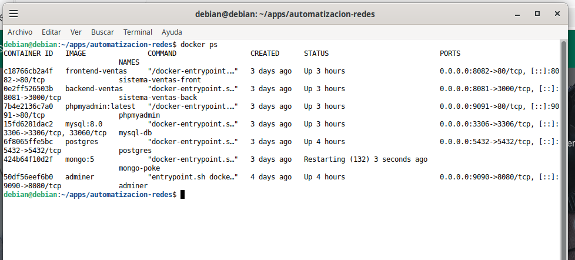


#### Dockerfile del Backend

Configuración del `Dockerfile` utilizado para el servicio backend con Node.js:

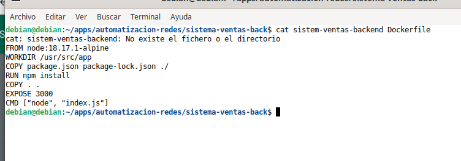


#### Dockerfile del Frontend

Configuración del `Dockerfile` utilizado para el servicio frontend con Nginx:

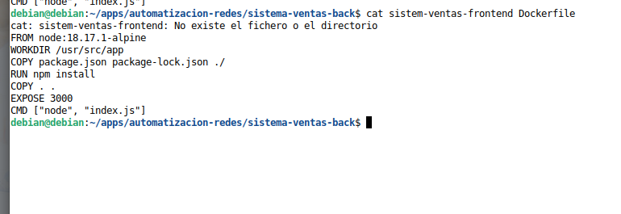


#### Archivo stack-myrt.yml

Archivo YAML de Docker Compose con la definición de todos los servicios del proyecto:

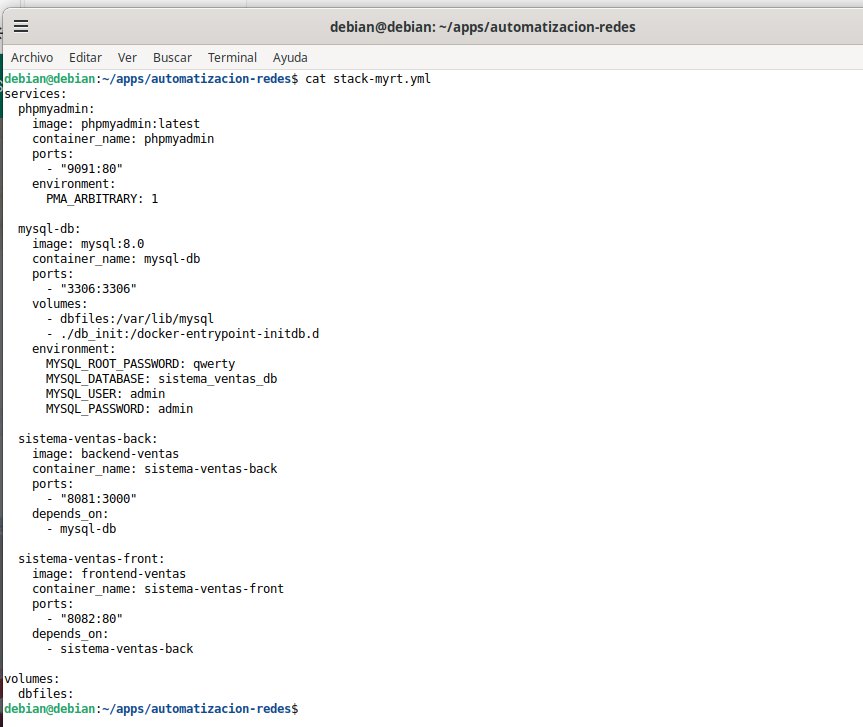


#### Frontend funcionando

Aplicación frontend accesible desde el navegador en `192.168.56.101:8082`.

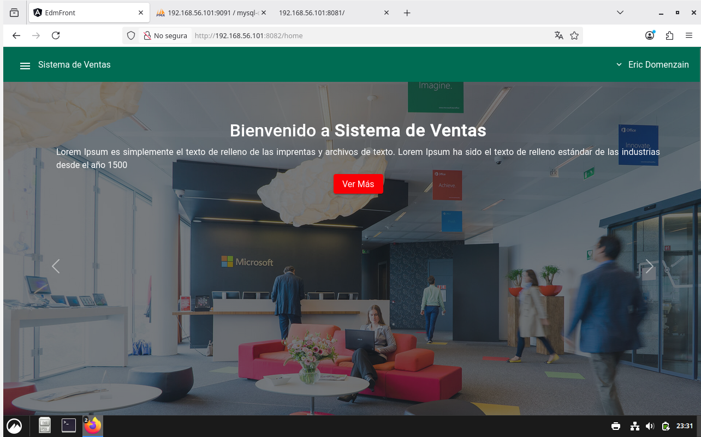


#### Backend funcionando

API backend accesible desde el navegador en `192.168.56.101:8081`:

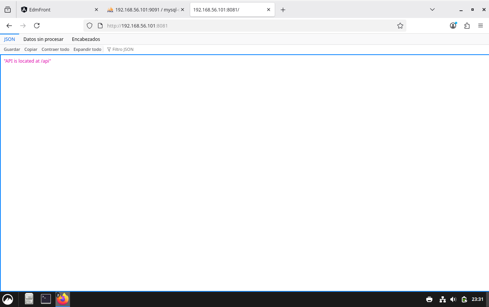


#### PhpMyAdmin funcionando

Interfaz de PhpMyAdmin accesible desde `192.168.56.101:9091`:

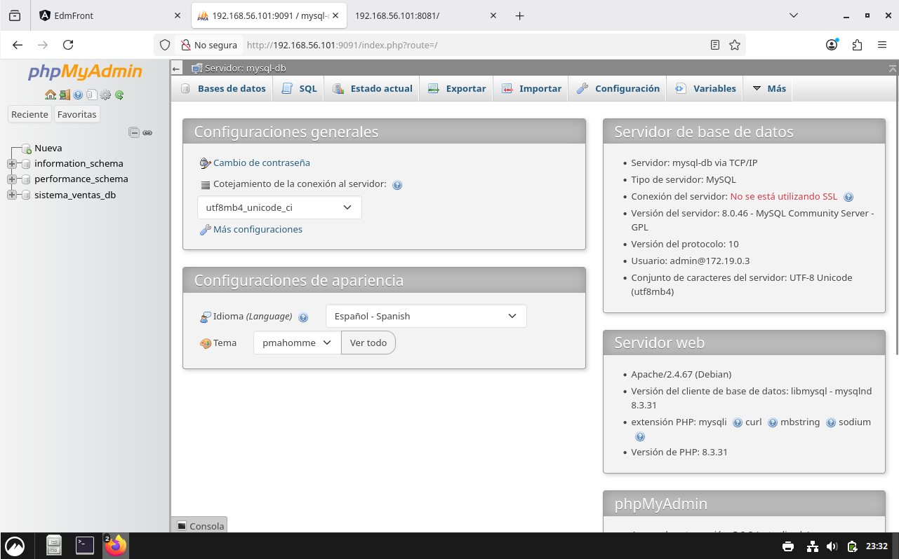


---

## Lista de verificación

| # | Elemento | Estado |
|---|----------|--------|
| 1 | Visual Studio Code instalado y funcional | ✅ |
| 2 | Docker Engine instalado en Debian | ✅ |
| 3 | Docker Compose instalado en Debian | ✅ |
| 4 | Git instalado en Debian | ✅ |
| 5 | Imagen hello-world ejecutada correctamente | ✅ |
| 6 | Archivo stack-myrt.yml creado y ejecutado | ✅ |
| 7 | Contenedor MySQL activo | ✅ |
| 8 | Contenedor PhpMyAdmin activo en puerto 9091 | ✅ |
| 9 | Contenedor Backend activo en puerto 8081 | ✅ |
| 10 | Contenedor Frontend activo en puerto 8082 | ✅ |
| 11 | Repositorio subido a GitHub | ✅ |

---

## Conclusión


Durante el desarrollo de esta primera unidad, se logró implementar de manera exitosa un entorno de desarrollo completo orientado a la automatización de infraestructura digital. A través de la instalación y configuración de Docker Engine, Docker Compose y Git en una máquina virtual con Debian, así como del uso de Visual Studio Code en Windows, se adquirieron habilidades prácticas fundamentales para el despliegue de aplicaciones en contenedores.

El uso de Docker permitió comprender la importancia de la contenedorización como estrategia para garantizar la portabilidad y reproducibilidad de los entornos de desarrollo. La orquestación de múltiples servicios mediante Docker Compose demostró ser una solución eficiente para gestionar aplicaciones complejas con componentes interdependientes, como fue el caso del sistema de ventas con base de datos MySQL, backend en Node.js, frontend en Nginx y administración mediante PhpMyAdmin.

Uno de los hallazgos más importantes fue la comprensión de cómo los archivos `Dockerfile` definen la construcción de imágenes personalizadas, y cómo el archivo YAML de Compose permite coordinar el ciclo de vida de todos los servicios de forma declarativa. Este enfoque reduce la posibilidad de errores de configuración y facilita la colaboración en equipos de trabajo. En conjunto, las herramientas utilizadas en esta unidad representan la base de las prácticas modernas de DevOps y automatización de redes.

---

## Anexo de recursos

Los siguientes recursos de la comunidad fueron consultados durante el desarrollo de esta unidad:

- Documentación oficial de Docker: [https://docs.docker.com](https://docs.docker.com)
- Docker Hub (imágenes oficiales): [https://hub.docker.com](https://hub.docker.com)
- Repositorio base del proyecto: [https://github.com/edomenzain/automatizacion-redes](https://github.com/edomenzain/automatizacion-redes)
- Documentación oficial de Git: [https://git-scm.com/doc](https://git-scm.com/doc)
- Documentación oficial de Visual Studio Code: [https://code.visualstudio.com/docs](https://code.visualstudio.com/docs)
- Documentación oficial de Nginx: [https://nginx.org/en/docs](https://nginx.org/en/docs)
- Documentación oficial de Node.js: [https://nodejs.org/en/docs](https://nodejs.org/en/docs)

---

## Bibliografía

Bell, P. (2014). *Introducing GitHub: A non-technical guide*. O'Reilly Media.

Gift, N., Behrman, K., Deza, A., & Bharga, G. (2019). *Python for DevOps: Learn ruthlessly effective automation*. O'Reilly Media.

Hillar, G. C. (2016). *Building RESTful Python web services*. Packt Publishing.

Jackson, C., Senyk, C., & Androić, R. (2020). *Cisco Certified DevNet Associate DEVASC 200-901 official cert guide*. Cisco Press.

Lenz, M. (2018). *Python continuous integration and delivery: A concise guide with examples*. Apress.

Tsitoara, M. (2019). *Beginning Git and GitHub: A comprehensive guide to version control, project management, and teamwork for the new developer*. Apress.